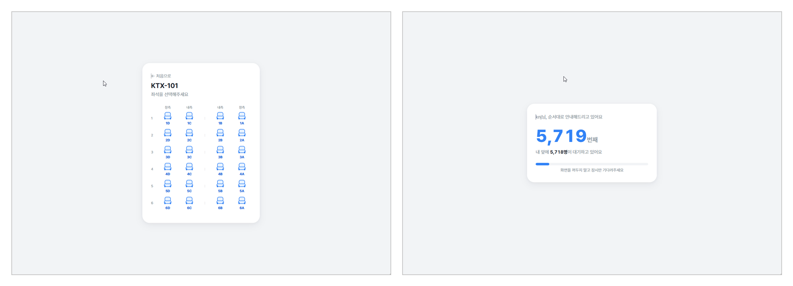
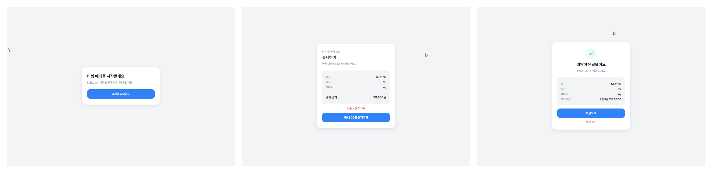
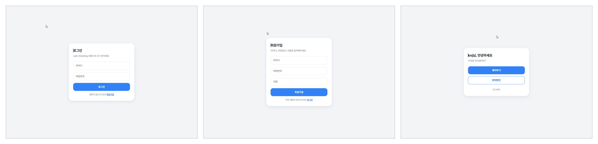

# 🚄 rush-ticketing

대규모 동시 접속 상황에서도 안정적으로 좌석을 예매할 수 있도록 설계한 KTX 스타일 티켓 예매 시스템입니다.
대기열(Queue) 기반 트래픽 제어와 동시성 처리를 중심으로, 실제 오픈런/티켓팅 환경을 재현하고 부하 테스트로 검증했습니다.

---

## 📸 화면 미리보기

### 좌석 선택 & 대기열 확인


### 티켓 예매 흐름 (대기열 참여 → 결제 → 예약 완료)


### 로그인 & 회원가입 & 메인


---

## ✨ 핵심 설계 포인트

- **Redis 기반 대기열(Waiting Queue) 설계**: 순간적으로 몰리는 트래픽을 Redis로 제어해, 서버 부하를 분산시키고 순번을 안정적으로 안내
- **좌석 선점 동시성 제어**: 여러 사용자가 동시에 같은 좌석을 예약해도 중복 배정이 발생하지 않도록 처리
- **k6 부하 테스트로 검증**: 수천 단위 가상 유저(VU) 시나리오로 대기열 진입 → 좌석 선택 → 결제까지 전체 플로우 부하 테스트 수행
  > 실제 테스트 결과 수치(VU 수, 응답시간, 에러율 등)는 여기에 채워 넣으면 좋아요.

---

## 🛠 기술 스택

| 구분 | 기술 |
|---|---|
| Backend | Python, FastAPI |
| DB | PostgreSQL |
| Cache / Queue | Redis |
| Package Manager | Poetry |
| Load Test | k6 |
| Infra | Docker |

---

## 📡 API 엔드포인트

> 주요 흐름 기준 정리로, 실제 라우터 명세와 다를 수 있어 필요시 맞춰 수정해줘.

| Method | Endpoint | 설명 |
|---|---|---|
| POST | `/api/auth/signup` | 회원가입 |
| POST | `/api/auth/login` | 로그인 |
| POST | `/api/auth/logout` | 로그아웃 |
| GET | `/api/trains` | 열차 목록 조회 |
| GET | `/api/trains/{trainId}/seats` | 좌석 현황 조회 |
| POST | `/api/queue/enter` | 대기열 진입 |
| GET | `/api/queue/status` | 대기 순번 조회 |
| POST | `/api/reservations` | 좌석 선점(예약 생성) |
| POST | `/api/reservations/{id}/payment` | 결제 처리 |
| GET | `/api/reservations/{id}` | 예약 상세 조회 |
| DELETE | `/api/reservations/{id}` | 예약 취소 |

---

## 🚀 실행 방법

### 1. 의존성 설치
```bash
poetry install
```

### 2. Redis 실행 (Docker)
```bash
docker exec -it rush-redis redis-cli FLUSHDB
```

### 3. 서버 실행
```bash
poetry run uvicorn app.main:app
```

### 4. 부하 테스트 (k6)
```bash
k6 run --vus 5000 --iterations 80000 k6/join_test.js
```

---

## 📝 블로그 정리

프로젝트를 진행하며 정리한 내용은 아래 블로그에서 더 자세히 볼 수 있어요.

👉 [https://backlog-dev.tistory.com/136](https://backlog-dev.tistory.com/136)